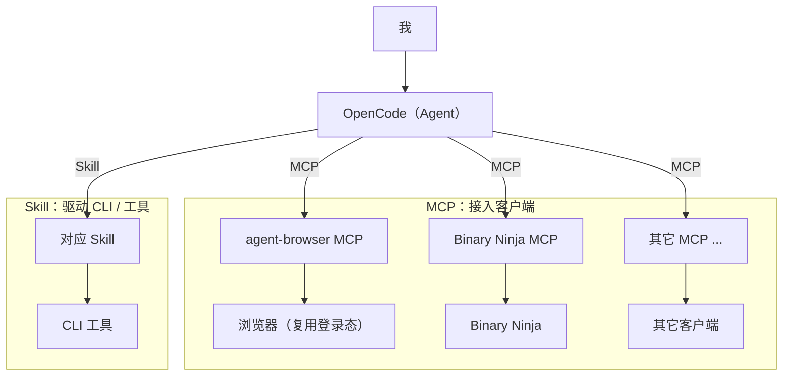

# 台本（口播稿）

> 使用说明：〔〕内是表演提示，不用念出来。`……`表示换气或停顿，别赶。

---

## 开场

〔看向镜头，轻松点〕

大家好，我是诡锋。

欢迎来到我的第一期杂谈。

先说一嘴……这是"杂谈"，不是"教程"。所以待会儿我哪句说得不对，你就当我在跟你唠嗑，别太当真。

〔停顿〕

本期主题，我纠结了很久。最后定成了——「又懒又穷的我，使用 Agent 的过程」。

我先声明啊，这不是什么励志故事。我不是那种"自律使我自由"的人。

恰恰相反。我连打开终端，都得先做个心理建设。

〔笑〕但你知道这世界妙在哪吗？

有一种东西，它就是专门为懒人和穷人生长的。它叫 Agent。

所以今天，我不聊原理，不聊论文。就聊一件事——

一个又懒又穷的人，是怎么把 Agent 的价值，一点一点榨出来的。

〔停顿〕

先看下今天要讲什么。

- 我的工作流架构图
- 使用免费的 Agent 方案
- 基础建设：用现有的 Skill、MCP，去引导 Agent 正确使用 CLI 和客户端
- 利用 Agent，开发自己的工具，或者修复那些跑不起来的工具
- 最后是结语，让大家自己发挥创造力

好，我们开始。

## 我的工作流架构图

〔点开架构图〕

先上一张我平时的工作流架构图。

别看它长得挺唬人。〔停顿〕其实一句话就能概括——

**Agent 是大脑，MCP 是接口，Skill 是说明书。**

〔停顿，指向图〕



这张图，第一眼看过去……〔停〕是不是有点像某公司年会 PPT 里，硬凑出来的"中台架构"？

〔笑〕但你先别急着划走。我给它拆成三层，你会发现它其实特别朴素。

第一层，Agent，也就是大脑。它跑在 OpenCode 里。

它负责什么呢？负责动脑子。理解我到底想要啥、把任务拆开、决定下一步该去戳哪个工具。

说白了，它是那个真正干活的。我啊，我就是那个提需求的甲方。

〔停顿〕

第二层，MCP，也就是接口。它的活，是把 Agent 的手，伸进各种客户端里。

举个例子。用 `agent-browser` 这个 MCP，直接操控你**已经登录**的浏览器。

或者用 Binary Ninja 的 MCP，去戳 Binary Ninja。

其它工具，按需接就行。图里画不下，我省了。

〔停顿〕

第三层，Skill，也就是说明书。这层是给谁准备的？

给那些"没有现成 MCP"的命令行工具。

用一份对应的 Skill，告诉 Agent：这玩意儿该怎么正确调用，哪些坑千万别踩。

〔停顿〕

那为什么要分这三层？因为现实里的工具，就两种。

一种是带界面的，GUI 客户端。另一种，是黑乎乎的命令行。

前者，用 MCP 能接上。后者，用 Skill 能驯服。

这么一搭，你看——不管对面是啥工具，Agent 都能"够得着"。那我呢？我就不用亲自伸手了。

## 使用免费的 Agent 方案

架构聊完，接下来是最灵魂的问题。

又穷、又懒，还想用 Agent，方案是啥？

〔停顿〕

答案特别朴素——**用 OpenCode，白嫖它的免费模型。**

OpenCode 官方本身就带一些免费模型。不用登录，直接就能用。

也不需要什么 OpenCode Zen。〔笑〕当然，你要想登录、想绑定，那也行，没人拦着你。

〔停顿〕

那问题来了：这些免费的额度，到底够不够用？

我不是拍脑袋下结论的人。这点我是真测过的。

爬网页、逆向 DLL、修 Chrome 插件的 bug……这些场景，我一个个跑了一遍。

要说连续对话的次数，要说它思考的深度——说实话，都挺夸张的。

但就是没一次，让我撞到上限。

〔停顿〕

所以我敢大胆假设、合理推断一句：

这套免费方案，应付日常**轻度到中度**的使用，绰绰有余。

你完全可以……把"给钱"这一步，先往后放一放。

〔停顿〕

当然，成年人得有 Plan B。

我的兜底方案，是 DeepSeek 的 API。

至少就目前来说，它的价格我还能接受。属于那种……肉疼，但还没到割肉的程度。

## 基础建设

好，方案定了。接下来，就是搭架子。

第一步，装软件。官网我放这儿了——OpenCode 官网。

随你喜好。装 TUI 也行，装 Desktop 也行。你要是就想要一个纯命令行的 CLI，我也不拦着。

〔停顿〕

装好之后，主要配三样东西。

还是那句话啊——按需来。不是让你照单全收。

### 本地服务器，可以通过 API 调用 Agent

〔切到配置文件〕

第一样，是本地的服务配置。

`~/.config/opencode/service.json`

```json
{
  "host": "0.0.0.0",
  "password": "xxx",
  "port": 4096
}
```

这里头，最关键的是 `host`。

你把它改成 `0.0.0.0`——这就等于，把你的服务暴露到了局域网。

〔停顿〕从此，你的 Agent 就不再是你电脑上的一个孤岛了。它变成了一个能被远程调用的服务。

建议搭配 OpenCode 的 SDK 一起用，调用起来更顺手。你能直接拿代码去驱动 Agent，而不是靠手敲命令。

〔停顿，笑〕

我自己就拿它干了件挺好玩的事。

我把 OpenCode，直接接进了 QQ。

这么一搞，这个 Agent 就从"坐在我电脑前才能用"，变成了……"躺在被窝里也能用"。

随时随地，找它就行。

### 添加一些你需要的 Skill

第二样，是 Skill。

装 Skill 这事，你都不用自己动手，直接让 Agent 来就行。

〔切屏幕〕你就打这么一行：

```
帮我安装下这个 Skill: <链接>
```

按需装就好。不过我私心，只推荐一个——

Matt Pocock 的 `writing-for-agents`。

〔停顿〕

这玩意儿是干嘛的？帮你**写文档**。

写什么呢？比如 skill、`AGENTS.md` 这类东西。

你可能想问：写个文档，也算基础建设？

算。而且是大头。

〔停顿〕因为文档写清楚了，Agent 后面干活才不容易跑偏。

它是照着你的说明书走的。说明书要是含糊，它就开始自由发挥。发挥着发挥着……〔停〕就跑到隔壁去了。

### 配置 MCP

第三样，是 MCP。

安装也一样，让 Agent 自己来。

但这里有个坑，你注意一下——**MCP 通常是依托某个具体客户端的。**

别指望它是个万能插头。

〔切屏幕〕还是那句话：

```
帮我接入下这个 MCP 服务: <链接>
```

MCP 我只推荐一个，其它的随你。

〔停顿〕

推荐这个——`agent-browser`。用来直接控制你手边的浏览器。

用法上有个小机关。先在你的 `~/.agent-browser` 目录里，创建一个 `config.json`。

内容写上一句：`{ "autoConnect": "true" }`。

〔停顿〕

这样它才会接上你**已经开着**的浏览器，而不是另起一个新窗口。

为什么要这么麻烦？因为只有接上你原来那个窗口，才能蹭到你现成的登录态。

否则呢？你让它干的每件事，都得先登一遍账号。那……〔停〕那还不如我自己动手呢。

## 利用 Agent，开发自己的工具，或修复无法正常使用的工具

前面讲的这些，说白了，都还是在"用好别人家的工具"。

这一节，我们往前走一步。也是我全程最爽的部分——

让 Agent 帮你**造工具**、**修工具**。

### 开发自己的工具

先说造工具。

以前啊，一个想法从"我想做"，到"我真有个能用的东西"……中间隔着的是完整的一套开发流程。

设计、编码、调试、测试、文档。〔停顿〕对懒人来说，这个门槛，基本等于一堵墙。

所以大部分想法，都夭折在脑子里了。

〔停顿〕

现在呢？这堵墙的高度，肉眼可见地，矮了一大截。

我的做法，大概是这样三步。

第一步，先把需求和验收标准讲清楚。

〔强调〕注意啊，"验收标准"这一步，特别关键。不然你验收出来的，压根不是你要的东西。

然后让 Agent 出个方案。这一步，也可以让 Matt Pocock 那个 Skill 帮忙。让它把功能点拆开，再对每个独立模块，分别测试。

〔停顿〕

第二步，测试一跑，bug 该冒的都会冒出来。

那就修。修完再测。反复迭代。

第三步，最后，用前面提过的 `writing-for-agents`，把开发和测试的文档补好。

这样下次你要维护的时候，Agent 才不至于"失忆"，一上来就开始跑偏。

〔停顿〕

什么小脚本、小工具、把某个烦人的重复流程自动化掉……这类脏活累活，基本都可以丢给它。

〔笑〕PS，说起来还有点骄傲。我用 Agent，帮我写了个 Agent。

它叫 Ruri。

虽然目前……有一阵子没维护了。主要是我太忙了。〔停〕真的。（不是懒，是忙，这句话请帮我记下来。）

### 修复无法正常使用的工具

好，造工具讲完了。接下来说修工具。

另一个特别常见的场景：某个工具年久失修，或者，在你自己的环境里，它就是死活跑不起来。

比如我做测试时遇到的那个 Chrome 插件 bug，就属于这一类。

〔停顿〕

解决办法其实很简单。核心就一句话——

**一定要让你的 Agent，能"碰到"你正在用的工具。**

插件本身，还有承载插件的那个宿主软件，都得让它够得着。

〔停顿〕

举个我自己的例子。

我在接入 Binary Ninja 的 MCP 插件时，它直接报错了。

换作以前……我大概会对着报错信息，发一会儿呆。然后默默关掉，假装无事发生。

〔笑〕但现在不一样了。

因为 Agent 能碰到这套东西，它会自己顺着报错去找方案，把 bug 修掉。

那我干嘛呢？我就负责在一旁当监工。偶尔……端茶倒水。

## 结语

最后，总结一下。

其实"又懒又穷"，压根不算什么问题。真正的问题是——你有没有把 Agent 用好。

〔停顿〕

三个关键词，送给大家。

**打底。**用免费的 OpenCode 方案撑住日常，兜底用 DeepSeek 的 API。

**接通。**用 MCP，把 Agent 接进各种客户端；用 Skill，教会它用命令行。

**进化。**让 Agent 帮你造工具、修工具，把重复劳动，统统交出去。

〔停顿〕

聊到这儿，你会发现一个挺有趣的悖论——

**你越是懒，就越有动力，去把这套东西搭起来。**

为什么呢？因为懒，它不是躺平。

懒，是一种对"重复劳动"的极度不耐烦。

而搭好之后，它能替你干掉的，恰好就是那些又烦又累、却又不得不做的事。

〔停顿，收〕

剩下的，就交给大家，自行发挥创造力了。

谢谢大家。我们下期再见——〔停，笑〕如果我勤快的话。
