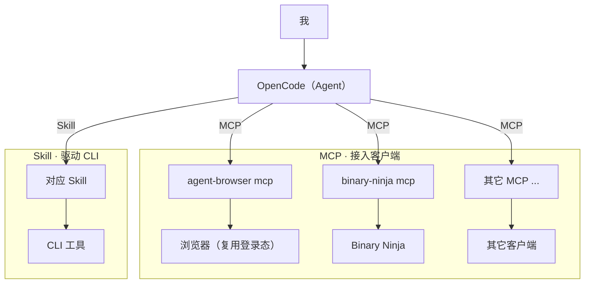

# 又懒又穷的我
# 使用 Agent 的过程

<div class="pt-8 opacity-70">
诡锋 · 第一期杂谈
</div>

<div class="pt-4 text-base opacity-80">
🙋 这一场，专门讲给「不懂技术」的朋友听
</div>

<div class="abs-br m-6 text-sm opacity-40">2026-10-08</div>

<!--
【开场】看向镜头，轻松点。

大家好，我是诡锋。欢迎来到我的第一期杂谈。

先说一嘴 —— 这是「杂谈」，不是「教程」。
所以待会儿我哪句说得不对，你就当我在跟你唠嗑，别太当真。

另外还有一件很重要的事，我要先讲清楚：
这一场，是专门讲给「不懂技术」的朋友听的。
不懂什么叫 Agent、不懂什么叫接口、平时看到代码就头晕 —— 那你就是我今天最想讲给你听的人。
今天几乎每个技术词，我都会先翻译成大白话，再往下讲，绝对不会默认你「应该懂」。

本期主题，我纠结了很久。最后定成了——「又懒又穷的我，使用 Agent 的过程」。
我先声明啊，这不是什么励志故事。我不是那种"自律使我自由"的人。
恰恰相反。我连打开终端，都得先做个心理建设。
-->

---
glow: bottom-left
---

# 先说清楚：这场讲给谁听

<div class="pt-5 text-xl leading-relaxed opacity-90">

这场分享，**不需要你懂任何技术**。

</div>

<div class="pt-4 text-lg leading-relaxed opacity-75">

- 没听过 「Agent」？太正常了。
- 不知道 「MCP」「Skill」「命令行」是啥？也非常正常。
- 不会写代码、不敢碰那个黑黑的命令窗口？完全不影响。

</div>

<div v-click class="plain-card mt-8 text-lg">

<span class="plain-tag">🗣️ 大白话</span>你只要会**玩手机、会点鼠标**，就能听懂接下来的一切。
碰到任何术语，我都会先用一句大白话翻译一遍。

</div>

<!--
【开场第二页：给非技术朋友吃颗定心丸】

在正式开始之前，我想先花一分钟，对一件事做个说明——
这场分享，是专门讲给「不懂技术」的朋友听的。

不是「有点基础」的那种懂，是——你从没写过代码、没听过「命令行」、看到一整屏代码就头疼，也完全没关系。
今天几乎所有的技术词，我都会先用一句大白话翻译过去，再往下讲。

所以请你放心，也别急着划走。这一场，就是为你准备的。

好，我先带你看一眼，今天大概会聊到什么。
-->

---
glow: bottom-left
---

# 目录

<v-clicks>

1. **工作流架构** —— Agent 是大脑，MCP 是接口，Skill 是说明书
2. **免费方案** —— OpenCode 免费模型打底，DeepSeek API 兜底
3. **基础建设** —— 本地服务 · Skill · MCP（附两个实战案例）
4. **造工具 · 修工具** —— 让 Agent 从「用工具」走到「改工具」
5. **结语** —— 懒，是一种生产力

</v-clicks>

<div v-click class="pt-6 text-base opacity-70">

全程大白话：每碰到一个术语，我都会先用一句人话解释清楚。

</div>

<!--
有一种东西，它就是专门为懒人和穷人生的。它叫 Agent。

所以今天，我不聊原理，不聊论文。就聊一件——一个又懒又穷的人，是怎么把 Agent 的价值，一点一点榨出来的。

先看下今天要讲什么……
1. 我的工作流架构图
2. 使用免费的 Agent 方案
3. 基础建设：用现有的 Skill、MCP，去引导 Agent 正确使用 CLI 和客户端
4. 利用 Agent，开发自己的工具，或者修复那些跑不起来的工具
5. 最后是结语，让大家自己发挥创造力

大家看到了，这五个部分，一个比一个技术。但你千万别慌。
每一个术语，我都会先用大白话翻译一遍。你只要跟上「它到底能干什么」就行。

好，我们开始。
-->

---
glow: top-right
---

# 名词翻译表

<div class="opacity-70">先混个脸熟。看不懂也完全没关系，后面每个都会细讲。</div>

<div style="font-size: 0.92em">

| 技术黑话 | 大白话翻译 |
| --- | --- |
| **Agent** | 住在电脑里的「AI 小助理」，会自己查资料、自己动手干活 |
| **模型** | 助理的「大脑」，脑子越聪明，活干得越好 |
| **MCP** | 给助理配的「转接头」，让它能操作带界面的软件 |
| **Skill** | 给助理看的「说明书 / 菜谱」，教它别按错按钮 |
| **GUI** | 有按钮、能用鼠标点的界面 |
| **命令行（CLI）** | 黑忽忽、只能打字下命令的窗口 |
| **API** | 程序之间传话的「服务窗口」，按用了多少来收费 |

</div>

<!--
这张表，你可以先拍个照。
里面每个词，我在后面都会用大白话再讲一遍。现在只要有个印象就行。

提前告诉你：里面那个 Agent、模型、MCP、Skill，是今天最重要的四个词。
听懂了这四个，今天这场你就听懂了八成。
-->

---
layout: section
glow: top-right
---

<div class="text-sm tracking-widest opacity-40">PART 01</div>

# 工作流架构

<!--
先上一张我平时的工作流架构图。
等等——先打住。我知道很多人一看到图，心里就“咯噔”一下。
尤其是不懂技术的朋友：完了，一上来就是图，我肯定看不懂了。
你放心。这张图其实一句话就能概括。而且待会儿我会拆成三层，一层一层给你揉碎了讲。
-->

---
glow: bottom-right
---

# 工作流架构

<div class="opacity-80">
用人话说：<b>我负责提要求，助理（Agent）负责把活干完</b>。<br>
那它靠什么干？靠下面这套「工具库」。
</div>



<!--
【点开架构图】

你看这张图，上面的圆圈是“我”，中间是 OpenCode，就是那个助理。
下面伸出四条线，分别指向浏览器、Binary Ninja、命令行工具……

翻译成大白话就是：
我一句话丢给助理，它自己判断该用哪个工具、怎么用，然后替我把活干了。
至于怎么干，我们先不纠结，看下一页。
-->

---
glow: full
---

# 拆成三层，就很朴素

| 层 | 定位 | 职责 | 代表 |
| --- | --- | --- | --- |
| **OpenCode** | 大脑 | 理解意图 · 拆解任务 · 调度工具 | Agent 运行时 |
| **MCP** | 接口 | 把 Agent 的手伸进 GUI 客户端 | `agent-browser` · `binary-ninja` |
| **Skill** | 说明书 | 教会 Agent 正确调用 CLI 工具 | `writing-for-agents` |

<div v-click class="pt-5 text-lg opacity-85">

🗣️ 打个比方：Agent 是**助理**，MCP 是**万能转接头**，Skill 是**操作手册**。

- Agent 负责动脑子，我负责提需求
- 现实里的工具就两种：**有界面的用 MCP 接**，**黑窗口的用 Skill 驯**
- 三层搭好，不管对面是啥工具，Agent 都「够得着」

</div>

<!--
这张图第一眼看过去……是不是有点像某公司年会 PPT 里，硬凑出来的"中台架构"？
但你先别急着划走。我给它拆成三层，你会发现它其实特别朴素。

我用一个生活里的比喻，你就全懂了。
你想象一下：你雇了一个助理（Agent）。
助理很聪明，但它手不够长——够不到你家各种电器。

于是你给它配了一个“万能转接头”（MCP）。
有了转接头，它就能插上你家那些带面板、带按钮的电器（比如浏览器）。

但如果有些工具根本没有面板，只有一本厚厚的操作手册（Skill）呢？
那就把手册交给它。它照着手册一步一步来，就不会把按钮按错。

所以你看，三层就是：一个聪明的助理、一个万能转接头、一叠操作手册。
一点都不神。

第一层，Agent，也就是大脑。它跑在 OpenCode 里。
它负责动脑子：理解我到底想要啥、把任务拆开、决定下一步该去戳哪个工具。
说白了，它是那个真正干活的。我啊，我就是那个提需求的甲方。

第二层，MCP，也就是接口。它的活，是把 Agent 的手，伸进各种客户端里。
比如用 agent-browser 这个 MCP，直接操控你已经登录的浏览器。

第三层，Skill，也就是说明书。给那些"没有现成 MCP"的命令行工具准备的。
用一份对应的 Skill，告诉 Agent：这玩意儿该怎么正确调用，哪些坑千万别踩。
-->

---
layout: two-cols
layoutClass: gap-10
glow: bottom
---

# 两类工具，两种接法

**GUI 客户端** —— 有按钮、能用鼠标点的软件

<div class="pt-4 opacity-80">

用 **MCP** 接入，
把 Agent 的操作映射到界面之上。

<div class="pt-2 text-sm opacity-70">例：浏览器、编辑器、任何有窗口的软件</div>

</div>

**命令行工具** —— 没有界面，只能在黑窗口里敲命令

<div class="pt-4 opacity-80">

用 **Skill** 驱动，
把「怎么调用、哪些坑」写成说明书。

<div class="pt-2 text-sm opacity-70">例：那些你听都没听过的小工具</div>

</div>

::right::

<div class="flex h-full flex-col justify-center gap-8">

<div class="tool-card">
<div class="text-2xl">🖥️ GUI 客户端</div>
<div class="pt-2 opacity-70">→ MCP</div>
</div>

<div class="tool-card">
<div class="text-2xl">⌨️ 命令行</div>
<div class="pt-2 opacity-70">→ Skill</div>
</div>

</div>

<style>
.tool-card {
  padding: 1rem 1.2rem;
  border-radius: 0.9rem;
  background: rgba(255, 255, 255, 0.04);
  border: 1px solid rgba(255, 255, 255, 0.12);
}
</style>

<!--
那为什么要分这三层？因为现实里的工具，就两种。

一种是带界面的，GUI 客户端。就是你平时用鼠标点来点去的那种软件，比如浏览器。
另一种，是黑忽忽的命令行。没有按钮，只能靠一行行打字才能指挥它。

前者，用 MCP 能接上（转接头插上就能用）。
后者，用 Skill 能驯服（把说明书丢给它）。

这么一搭，你看——不管对面是啥工具，Agent 都能"够得着"。那我呢？我就不用亲自伸手了。
-->

---
layout: section
glow: top-left
---

<div class="text-sm tracking-widest opacity-40">PART 02</div>

# 免费方案

<!--
架构聊完，接下来是最灵魂的问题：又穷、又懒，还想用 Agent，方案是啥？

先解释一个词：模型。
你可以把模型理解成助理的“大脑”。脑子越聪明，活干得越好；但越聪明的大脑，往往越贵。
而我们今天要聊的，就是——怎么用不花钱的脑子，把事情办了。
-->

---
glow: center
---

# 方案：免费打底，付费兜底

| | 主方案 | 兜底方案 |
| --- | --- | --- |
| **工具** | OpenCode 免费模型 | DeepSeek API |
| **成本** | 免费 | 按量付费 |
| **门槛** | 免登录即用 | 需 API Key |
| **适用** | 轻度 ~ 中度日常 | 高强度 · 长任务 |

<div v-click class="pt-6 opacity-85">

<div class="plain-card text-lg">

<span class="plain-tag">🗣️ 大白话</span>「免费模型」＝ 不花钱的助理大脑，日常够用；
实在不够，再充值 DeepSeek 这个**按量付费**的备用大脑。

</div>

<div class="pt-6 text-xl">

结论：日常先白嫖，把「给钱」这一步往后放。

</div>

</div>

<!--
答案特别朴素——用 OpenCode，白嫖它的免费模型。
OpenCode 官方本身就带一些免费模型。不用登录，直接就能用。
也不需要什么 OpenCode Zen。当然，你要想登录、想绑定，那也行，没人拦着你。

请记住——“模型”就是助理的脑子。免费的脑子，日常活完全够用了。

当然，成年人得有 Plan B。我的兜底方案，是 DeepSeek 的 API。
API 是什么呢？你就把它当成一个“服务窗口”：你问多少，它就收多少钱，用多少付多少。
至少就目前来说，它的价格我还能接受。属于那种……肉疼，但还没到割肉的程度。
-->

---
glow: bottom-right
---

# 实测：日常负载，未触达上限

<div class="grid grid-cols-3 gap-5 pt-6">
<div class="step-card">

### 🕷️ 网页抓取

长文档 · 多章节
批量提取到 Markdown

</div>
<div class="step-card">

### 🧩 DLL 逆向

Binary Ninja MCP
多轮分析交互

</div>
<div class="step-card">

### 🔧 插件调试

Chrome 扩展
端到端排障

</div>
</div>

<div v-click class="case-card mt-8 text-base">

连续对话轮次与思考深度充足，**一次都没触发「限流」**。<br>
🗣️ 「限流」＝ 聊到一定量就不让你用了。我把这些活全跑了一遍，一次都没撞到上限。

</div>

<!--
那问题来了：这些免费的额度，到底够不够用？我不是拍脑袋下结论的人。这点我是真测过的。

先说个词：限流。
你可以把它理解成“用量封顶”——比如聊到一定次数，就不让你用了，要等第二天或者要花钱。
很多人担心免费的东西聊两句就被卡住。所以我专门测了一下。

爬网页、逆向 DLL、修 Chrome 插件的 bug……这些场景，我一个个跑了一遍。
看不懂这些词没关系，你只要知道：这些都是很费脑子、很磨时间的活。
要说连续对话的次数，要说它思考的深度——说实话，都挺夸张的。
但就是没一次，让我撞到上限。

所以我敢大胆假设、合理推断一句：
这套免费方案，应付日常轻度到中度的使用，绰绰有余。
-->

---
layout: section
glow: top-right
---

<div class="text-sm tracking-widest opacity-40">PART 03</div>

# 基础建设

<!--
好，方案定了。接下来，就是搭架子：装软件，然后配三样东西。

这里先给你交个底：这一段听起来像技术活，但其实你几乎不用动手。
你只需要对助理说“帮我装”，剩下的它自己干。
而且——按需来，不是让你照单全收。哪样用不上，跳过就行。
-->

---
glow: full
---

# 三步搞定环境

<div class="grid grid-cols-3 gap-5 pt-8">
<div v-click class="step-card">

<div class="text-sm opacity-50">STEP 1</div>

### 🧩 安装 OpenCode

TUI / Desktop / CLI
官网：{OpenCode}

</div>
<div v-click class="step-card">

<div class="text-sm opacity-50">STEP 2</div>

### 📖 接入 Skill

让 Agent 直接装
教会它用命令行

</div>
<div v-click class="step-card">

<div class="text-sm opacity-50">STEP 3</div>

### 🔌 配置 MCP

让 Agent 接入
你现有的客户端

</div>
</div>

<div v-click class="pt-8 text-center text-lg opacity-70">

三个配置都交给自己 & Agent 完成 —— 不用手写、不用背命令。

</div>

<!--
第一步，装软件。官网我放这儿了——OpenCode 官网。
随你喜好。装 TUI 也行，装 Desktop 也行。你要是就想要一个纯命令行的 CLI，我也不拦着。

这三个是什么东西呢？用一个比喻：
TUI，就像在餐厅里对着菜单点单的窗口。
Desktop，就是普通的带按钮的软件。
CLI，就是那个黑窗口，纯靠打字。
选哪个都行，就跟选苹果还是安卓一样，看你顺手。

装好之后，主要配三样东西：
第一样，本地的服务配置，通过 API 调用 Agent。
第二样，是 Skill。
第三样，是 MCP。
还是那句话啊——按需来。不是让你照单全收。
-->

---
glow: bottom-right
---

# ① 本地服务：让 Agent 可被远程调用

<div class="opacity-70"><code>~/.config/opencode/service.json</code></div>

```json
{
  "host": "0.0.0.0",
  "password": "xxx",
  "port": 4096
}
```

<div v-click class="pt-4 opacity-85">

把 `host` 改成 `0.0.0.0`，服务就暴露到**局域网**。<br>
🗣️ 说白了：助理从「只能在这台电脑上用」，变成「同一个 Wi-Fi 下的手机也能叫它」。

</div>

<div v-click class="pt-3 opacity-85">

搭配 OpenCode SDK，用代码驱动 Agent。我把它接进了 **QQ**：
「坐在电脑前才能用」→「躺在被窝里也能用」。

</div>

<!--
第一样，是本地的服务配置。~/.config/opencode/service.json。

别被这个文件名吓到，你就理解成：一个给助理开的"总开关"。
这里头，最关键的是 host。你把它改成 0.0.0.0——这就等于，把你的服务暴露到了局域网。
局域网是什么？就是你家同一个 Wi-Fi 下的设备都能互相看到。

从此，你的 Agent 就不再是你电脑上的一个孤岛了。它变成了一个能被远程调用的服务。
也就是说，不只是这台电脑能用，你手机、平板，只要连的是同一个 Wi-Fi，都能叫它干活。

建议搭配 OpenCode 的 SDK 一起用，调用起来更顺手。你能直接拿代码去驱动 Agent，而不是靠手敲命令。

我自己就拿它干了件挺好玩的事——我把 OpenCode，直接接进了 QQ。
这么一搞，这个 Agent 就从"坐在我电脑前才能用"，变成了"躺在被窝里也能用"。
-->

---
glow: bottom-left
---

<div class="pb-3">
<span class="case-tag">案例 01 · 环境搭建</span>
</div>

# 一句话装好 Rust 环境

<div class="chat pt-4">
  <div class="msg right">帮我装一下 Rust 环境</div>
  <div class="msg left"><span class="who">Agent</span>检测系统环境，通过 rustup 安装工具链并配置 PATH。</div>
  <div class="msg left"><span class="who">Agent</span>验证通过：<code>rustc --version</code> / <code>cargo --version</code>。</div>
</div>

<div class="case-card mt-6 text-base">

🗣️ 「装环境」＝ 让这台电脑先具备运行某个软件的条件。<br>
💡 **要点**：这是一次性脏活 —— 你只下达目标 + 验收结果，中间的下载、配置、排错全部外包。

</div>

<!--
第一样配置聊完，先插一个特别接地气的案例。

先解释一下什么是“环境”：
你可以把它理解成“让这台电脑具备运行某个软件的条件”。
就好像你要煮饭，得先有锅、有米、有火。缺一样，都开不了火。

我懒得自己一步步配环境，就直接跟 Agent 说：帮我装一下 Rust 环境。
它自己检测系统、跑 rustup、配 PATH，最后还验证了 rustc 和 cargo 的版本。

上面这几个词你完全不用记，你只要看它做了几件事：先检查、再下载、再配置、最后还自己验证了一遍。
环境搭建这种"一次性脏活"，交给它之后，我只要下达目标、验收结果就行。
中间的下载、配置、排错，全都不归我管了。
-->

---
glow: full
---

# ② Skill：让 Agent 自己装

```text
帮我安装下这个 Skill: <链接>
```

<div class="pt-4 opacity-80">按需装即可。私心只推荐一个 ——</div>

<div class="case-card mt-4">

### 📖 Matt Pocock · `writing-for-agents`

帮你**写文档** —— 比如 skill、`AGENTS.md` 这类东西。

</div>

<div v-click class="pt-5 opacity-85">

🗣️ Skill 是什么？就是给助理看的**说明书**。<br>
写文档也算基础建设？算，而且是大头 ——
说明书一含糊，Agent 就开始自由发挥，发挥着发挥着就跑到隔壁去了。

</div>

<!--
第二样，是 Skill。装 Skill 这事，你都不用自己动手，直接让 Agent 来就行。
你就打这么一行：帮我安装下这个 Skill: <链接>。

再说一遍：Skill 就是给助理看的“说明书”。
给那些没有现成转接头的工具用的——把“该怎么用、哪些坑别踩”写清楚，助理就照着做。

按需装就好。不过我私心，只推荐一个——Matt Pocock 的 writing-for-agents。
这玩意儿是干嘛的？帮你写文档。写什么呢？比如 skill、AGENTS.md 这类东西。
你可能想问：写个文档，也算基础建设？算。而且是大头。
因为文档写清楚了，Agent 后面干活才不容易跑偏。说明书要是含糊，它就开始自由发挥。
这就好比做菜——菜谱写得含糊，厨师就只能凭感觉，最后端出来的东西，往往不是你想吃的。
-->

---
glow: bottom-right
---

# ③ MCP：让 Agent 接入客户端

```text
帮我接入下这个 MCP 服务: <链接>
```

<div v-click class="case-card mt-6 text-base">

🗣️ MCP 就像给助理装的一个「专用转接头」：**一个 MCP，对应一个具体软件**，不是万能插头。

</div>

<div v-click class="pt-6 opacity-85">

推荐 `agent-browser` —— 直接控制你手边的浏览器。
先在 `~/.agent-browser/config.json` 写入：

</div>

<div v-click class="pt-3">

```json
{ "autoConnect": "true" }
```

</div>

<div v-click class="pt-3 opacity-75">

这样它才接上**已经开着**的浏览器，复用现成的登录态 ——
否则每件事都得先登一遍账号。

</div>

<!--
第三样，是 MCP。安装也一样，让 Agent 自己来。

还记得前面那个比喻吗？MCP 就是给助理装的“转接头”。
但这里有个坑，你注意一下——这个转接头通常是专用的，对应某个具体软件。别指望它是个万能插头。
比如浏览器有浏览器的转接头，别的软件有别的。

还是那句话：帮我接入下这个 MCP 服务: <链接>。

MCP 我只推荐一个——agent-browser。用来直接控制你手边的浏览器。
用法上有个小机关。先在你的 ~/.agent-browser 目录里，创建一个 config.json。
内容写上一句：{ "autoConnect": "true" }。
这样它才会接上你已经开着的浏览器，而不是另起一个新窗口。
为什么要这么麻烦？因为只有接上你原来那个窗口，才能蹭到你现成的登录态。
登录态是什么？就是你那个已经登录好了的账号状态。蹭到了它，就不用每件事都从头登一遍。
-->

---
glow: bottom
---

<div class="pb-3">
<span class="case-tag">案例 02 · 网页抓取 → 知识库</span>
</div>

# 采集攻略，自动生成 Markdown 知识库

<div class="chat pt-3" style="font-size: 0.95em;">
  <div class="msg right">采集一下空轨 2nd 的攻略，形成知识库：<code>trails-game.com/walkthrough/sora-2nd-walkthrough/</code></div>
  <div class="msg left"><span class="who">Agent</span>抓取页面，HTML 已保存（<b>10720 行</b>），先摸清章节结构。</div>
  <div class="msg left"><span class="who">Agent</span>结构清晰：存档继承 + 序章 + 七章。并行派出子代理提取各章内容。</div>
  <div class="msg left"><span class="who">Agent</span>七章全部提取完毕，写入知识库文件（原攻略缺失处已注明）。</div>
</div>

<div class="case-card mt-5">

🎯 **链路**：抓取页面 → 理清结构 → **并行子代理**提取 → 存成 Markdown 知识库<br>
🗣️ 「子代理」＝ 助理又叫来几个小助理，分头干活，一起把七章搬回来。

</div>

<!--
再说一个我自己特别满意的案例。

先交代一下背景：空轨是一款游戏，“攻略”就是网上的通关指南。
很多游戏攻略特别长，一章一章全是字，自己复制粘贴整理，能把人逼疯。

我跟它说：采集一下空轨 2nd 的攻略，形成知识库，链接丢给它。
它自己把页面抓下来，HTML 保存了 10720 行；先摸清章节结构，发现是"存档继承 + 序章 + 七章"；
然后并行派出子代理去提取各章内容；最后七章全部提取完，写进知识库文件。

“子代理”你可以理解成：一个助理忙不过来，就又叫来几个小助理，分头干活。
原攻略里第七章当时还没更新完整，它还主动注明了。

整个链路，翻译成人话就是：把网页内容抓下来 → 理清楚分了几章 → 多个人分工搬运 → 存成一份整齐的文档。
我就只说了一句话。
-->

---
layout: section
glow: top-right
---

<div class="text-sm tracking-widest opacity-40">PART 04</div>

# 造工具 · 修工具

<!--
前面讲的这些，说白了，都还是在"用好别人家的工具"。
这一节，我们往前走一步。也是我全程最爽的部分——让 Agent 帮你造工具、修工具。

先解释一下，这里的"工具"到底是什么。
不是螺丝刀、锄头，而是——一个小软件、一个小脚本，能帮你自动干一件重复的事。
比如自动给一堆文件改名、自动把网页内容存下来。这种小玩意儿，就叫工具。

"造工具"，就是本来没有，让助理给你做一个。
"修工具"，就是本来有、但坏了用不了，让助理给你修好。
-->

---
layout: two-cols-header
layoutClass: gap-8
glow: bottom
---

# 从「我想做」到「能用的东西」

::left::

<div class="pt-2 text-xl opacity-50">以前</div>

<div class="mt-4 leading-relaxed">

设计 → 编码 → 调试 → 测试 → 文档

<div class="pt-4 opacity-80">

一道完整开发流程，
对懒人来说约等于**一堵墙** ——
想法基本都夭折在脑子里。

</div>
</div>

::right::

<div class="pt-2 text-xl">现在</div>

<div class="mt-4 leading-relaxed">

这堵墙的高度，肉眼可见地，**矮了一大截**。

<div v-click class="pt-4 opacity-80">

于是那些原本夭折的想法，终于有机会落地。

</div>
</div>

<!--
先说造工具。
其实“工具”这个词你不要想得太重，它就是一个能帮你自动干重复活的小玩意儿。
以前啊，一个想法从"我想做"，到"我真有个能用的东西"……中间隔着的是完整的一套开发流程。
设计、编码、调试、测试、文档。这五个词你不用逐字记，反正就是一大堆很磨人的步骤。
对懒人来说，这个门槛，基本等于一堵墙。
所以大部分想法，都夭折在脑子里了。
现在呢？这堵墙的高度，肉眼可见地，矮了一大截。
-->

---
glow: full
---

# 造工具：三步工作流

<v-clicks>

1. **讲清需求 + 验收标准**，让 Agent 出方案，把功能点拆开、逐模块测试
   - ⚠️「验收标准」最关键 —— 不然验收出来的压根不是你要的东西
2. **跑测试 → 修 bug → 再测**，反复迭代
3. **补文档**（`writing-for-agents`），记好开发与测试，下次维护不「失忆」

</v-clicks>

<div v-click class="case-card mt-6 opacity-85">

小脚本、小工具、把烦人的重复流程自动化 —— 这类脏活累活，基本都可以丢给它。<br>
🗣️ 你要做的，只是把「做成什么样算合格」讲清楚。

</div>

<!--
我的做法，大概是这样三步。
第一步，先把需求和验收标准讲清楚。
“验收标准”这个词听起来专业，其实特别好懂：就是“做成什么样，才算合格”。
比如你说“帮我做个记账工具”——那什么叫合格？是能记录就行，还是要能统计、能导出？
这一步不说清楚，最后你验收出来的，压根不是你要的东西。就像点菜不说忌口，端上来的可能就是你不吃的。
然后让 Agent 出个方案。这一步，也可以让 Matt Pocock 那个 Skill 帮忙。让它把功能点拆开，再对每个独立模块，分别测试。

第二步，测试一跑，bug 该冒的都会冒出来。bug 就是小毛病、小差错。那就修。修完再测。反复迭代。

第三步，最后，用前面提过的 writing-for-agents，把开发和测试的文档补好。
这样下次你要维护的时候，Agent 才不至于"失忆"，一上来就开始跑偏。
-->

---
layout: statement
glow: center
---

# 我用 Agent
# 写了个 Agent

<div class="mt-8 text-2xl">它叫 <b>Ruri</b></div>

<div class="mt-4 text-base opacity-60">🗣️ 说人话：我让一个助理，又造了一个助理出来。</div>

<div class="mt-6 opacity-50">（有一阵子没维护了……主要是我太忙了。真的。）</div>

<div class="mt-2 text-sm opacity-40">不是懒，是忙 —— 这句话请帮我记下来。</div>

<!--
PS，说起来还有点骄傲。我用 Agent，帮我写了个 Agent。它叫 Ruri。
“用 Agent 写 Agent”，听起来像拗口令。
翻译成大白话就是：我让一个助理，又去造了另一个助理出来。
虽然目前……有一阵子没维护了。主要是我太忙了。真的。
（不是懒，是忙，这句话请帮我记下来。）
-->

---
glow: bottom
---

# 修工具：一条核心原则

<div class="mt-12 text-3xl leading-relaxed">

一定要让你的 Agent，
能 **「碰到」你正在用的工具**

</div>

<div class="mt-8 text-lg opacity-70">

插件本身、它依附的那个软件、还有电脑记下的日志 —— 都得让它够得着。

</div>

<!--
好，造工具讲完了。接下来说修工具。
另一个特别常见的场景：某个工具年久失修，或者，在你自己的环境里，它就是死活跑不起来。
比如我做测试时遇到的那个 Chrome 插件 bug，就属于这一类。

解决办法其实很简单。核心就一句话——
一定要让你的 Agent，能"碰到"你正在用的工具。
插件本身，还有装着它的那个软件，甚至系统日志，都得让它够得着。

“够得着”这三个字，你就理解成：助理能不能亲眼看到、亲手摸到出问题的地方。
看不到，它就只能猜；看得到，它才能对症下药。
-->

---
glow: top-right
---

<div class="pb-3">
<span class="case-tag">案例 03 · 排障</span>
</div>

# 修复 Chrome 插件：`deepseek-pp-more` 的过程

<div class="chat pt-3" style="font-size: 0.95em;">
  <div class="msg right">服务好像还是起不来？</div>
  <div class="msg left"><span class="who">Agent</span>本地无进程、无端口监听、日志未生成 → 启动脚本没执行到 <code>Start-Process</code>。</div>
  <div class="msg left"><span class="who">Agent</span>打开扩展侧边栏 → 配置页：<code>0.0.0.0:12345</code>，Native Host 已连接、密钥已启用。</div>
  <div class="msg left"><span class="who">Agent</span>点「启动中转服务」→ 卡在「重连中…」，系统侧仍无进程 / 日志。</div>
  <div class="msg left"><span class="who">Agent</span>手动复现扩展要执行的 PowerShell 脚本，定位真实报错。</div>
</div>

<div class="case-card mt-4">

🎯 Agent 同时「够得着」**扩展界面 + 配套小助手 + 系统日志**，才能从头到尾找到病根。<br>
🗣️ 「插件」＝ 装在浏览器里的小功能；「日志」＝ 电脑默默记下来的“工作流水账”。

</div>

<!--
举个我自己的例子。先说背景：
“插件”就是装在浏览器里的小功能，很多你平时用的方便功能，都是插件。“日志”就是电脑默默记下来的“工作流水账”，出问题了就翻它找原因。

我在接入 Binary Ninja 的 MCP 插件时，它直接报错了。
换作以前……我大概会对着报错信息，发一会儿呆。然后默默关掉，假装无事发生。
不光看不懂，连该问谁都不知道。
但现在不一样了。因为 Agent 能碰到这套东西，它会自己顺着报错去找方案，把 bug 修掉。
那我干嘛呢？我就负责在一旁当监工。偶尔……端茶倒水。

（这个案例里，Agent 自己看了系统状态、翻了浏览器扩展界面、点了配置页、复现了那串启动脚本，
一步步把报错定位出来——因为它同时能碰到界面、配套小助手和系统日志。）
-->

---
layout: section
glow: bottom
---

<div class="text-sm tracking-widest opacity-40">PART 05</div>

# 结语

<!--
最后，总结一下。
其实"又懒又穷"，压根不算什么问题。真正的问题是——你有没有把 Agent 用好。

对不懂技术的朋友，我再啰嗦一句：
今天这些词，你全记不住也没关系。你只要记住一件事——
现在，一个不会代码的人，也能对着电脑说一句话，让它替你把活干了。
会不会用它，比懂不懂技术，更重要。
-->

---
glow: full
---

# 三个关键词

<div class="grid grid-cols-3 gap-6 pt-8">
<div v-click class="step-card">
<h3>打底</h3>
<p>用免费的 OpenCode 方案撑住日常，<br>兜底用 DeepSeek 的 API。</p>
</div>
<div v-click class="step-card">
<h3>接通</h3>
<p>用 MCP 把 Agent 接进客户端，<br>用 Skill 教会它用命令行。</p>
</div>
<div v-click class="step-card">
<h3>进化</h3>
<p>让 Agent 帮你造工具、修工具，<br>把重复劳动统统交出去。</p>
</div>
</div>

<!--
三个关键词，送给大家。你记不住也没事，我用一句大白话帮你串一下。

打底。先用不花钱的方案把日常保住，实在不够了，再掏钱。
翻译：先白嫁，别一上来就充值。

接通。给助理配上转接头（MCP）和说明书（Skill），让它能真正操纵你手边的软件。
翻译：把助理的“手”接上，它才能真干活。

进化。让它帮你造工具、修工具，把重复劳动，统统交出去。
翻译：从“用工具”，变成“让它帮你造工具”。
-->

---
layout: statement
glow: center
---

# 你越是懒
# 就越有动力，去把这套东西搭起来

<p class="opacity-50">懒，不是躺平 —— 是一种对「重复劳动」的极度不耐烦。</p>

<!--
聊到这儿，你会发现一个挺有趣的悖论——
你越是懒，就越有动力，去把这套东西搭起来。

为什么呢？因为懒，它不是躺平。
懒，是一种对"重复劳动"的极度不耐烦。
而搭好之后，它能替你干掉的，恰好就是那些又烦又累、却又不得不做的事。
-->

---
layout: end
glow: bottom
---

# 谢谢大家

<div class="pt-4 text-xl opacity-60">

剩下的，就交给大家，自行发挥创造力了。

</div>

<div v-click class="pt-10 opacity-40">

我们下期再见 —— 如果我勤快的话。😄

</div>

<!--
【停顿，收】
剩下的，就交给大家，自行发挥创造力了。
谢谢大家。我们下期再见——如果我勤快的话。
-->
